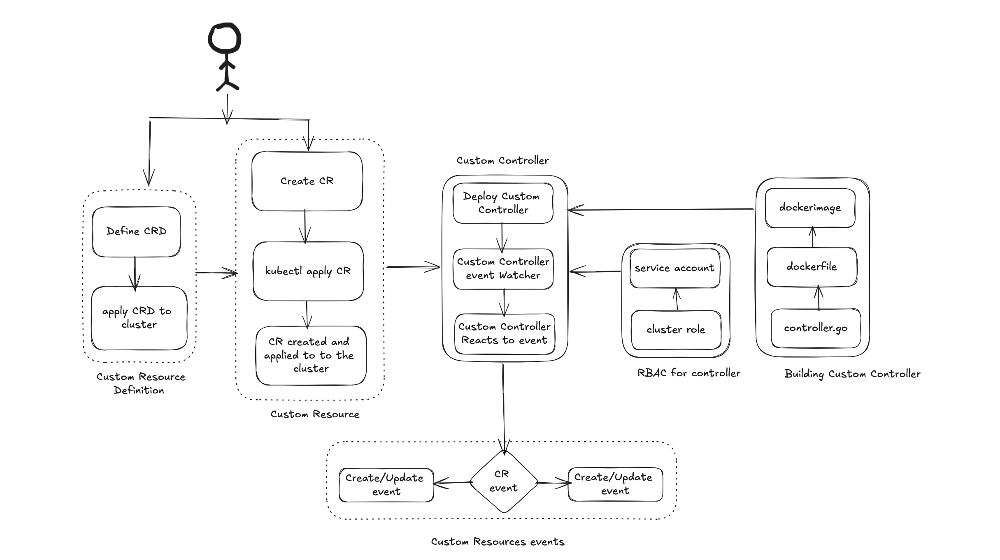

# k8c-certs-manager
This Custom Kubernetes Controller enable developers on any Kubernetes clusters to request TLS certificates 
that they can incorporate into their application deployments.

## Description
We have a Kubernetes cluster on which we can run applications. These applications will often expose HTTP 
endpoints through which other applications and end users can access them. To make sure that a secure connection 
to those endpoints is possible, we want to provide an automated and self-service way of requesting TLS 
certificates to secure incoming traffic.Developers deploying their applications can include a custom “Certificate” 
resource with their application manifest so that they don’t need to interact with an external system to request certificates.
This Custom Controller watches a custom resource “Certificate”, processes it and creates matching TLS certificate 
secrets. Certificates issued by this controller do not need to be signed by a CA (they should be self-signed). This 
also automatically renew a Certificate when it expires.
Minimum CRD this resource required is:
```yaml
apiVersion: certs.k8c.io/v1
kind: Certificate
metadata:
  labels:
    app.kubernetes.io/name: k8c-certs-manager
    app.kubernetes.io/managed-by: kustomize
  name: certificate-sample
spec:
  dnsName: example.k8c.io
  validity: 360d
  secretRef:
    name: my-certificate-secret
```

The Event flow for the Controller is described in the diagram:


## Getting Started

### Prerequisites
- go version v1.21.0+
- docker version 17.03+.
- kubectl version v1.11.3+.
- Access to a Kubernetes v1.11.3+ cluster.

## Deployment Workflow



### To Deploy on the cluster
**Build and push your image to the location specified by `IMG`:**

```sh
make docker-build docker-push IMG=<some-registry>/k8s-cert-manager:tag
```

**NOTE:** This image ought to be published in the personal registry you specified.
And it is required to have access to pull the image from the working environment.
Make sure you have the proper permission to the registry if the above commands don’t work.

### To Install
**Install the CRDs into the cluster:**

```sh
make install
```

**Deploy the Manager to the cluster with the image:**

```sh
make deploy IMG=<some-registry>/k8s-cert-manager:tag
```

> **NOTE**: If you encounter RBAC errors, you may need to grant yourself cluster-admin
privileges or be logged in as admin.

**Create instances of your solution**
You can apply the samples (examples) from the config/sample:

```sh
kubectl apply -k config/samples/certs_v1_certificate.yaml
```
This will create a Certificate resource in your Kubernetes Cluster and Create a Certificate Store at SecretRef provide as part of Resource Definition

>**NOTE**: Ensure that the samples has default values to test it out.

### To Uninstall
**Delete the instances (CRs) from the cluster:**

```sh
kubectl delete -k config/samples/certs_v1_certificate.yaml
```

**Delete the APIs(CRDs) from the cluster:**

```sh
make uninstall
```

**UnDeploy the controller from the cluster:**

```sh
make undeploy
```

## Project Distribution

Following are the steps to build the installer and distribute this project to users.

1. Build the installer for the image built and published in the registry:

```sh
make build-installer IMG=<some-registry>/k8c-certs-manager:tag
```

NOTE: The makefile target mentioned above generates an 'install.yaml'
file in the dist directory. This file contains all the resources built
with Kustomize, which are necessary to install this project without
its dependencies.

2. Using the installer

Users can just run kubectl apply -f <URL for YAML BUNDLE> to install the project, i.e.:

```sh
kubectl apply -f https://raw.githubusercontent.com/<org>/k8c-certs-manager/<tag or branch>/dist/install.yaml
```

## Controller Demo

To perform the Demo make sure you have:
1. Install and Create a local kubernetes cluster using kind [steps](https://kind.sigs.k8s.io/docs/user/quick-start/). Also apply the `ingress-config` as follow:
```sh
pprtik@Pratiks-MBP k8c-certs-manager % kind create cluster --image=kindest/node:v1.23.6@sha256:1af0f1bee4c3c0fe9b07de5e5d3fafeb2eec7b4e1b268ae89fcab96ec67e8355 --config=config/samples/ingress-config.yaml --name kubermatics-demo
Creating cluster "kubermatics-demo" ...
 ✓ Ensuring node image (kindest/node:v1.23.6) 🖼
 ✓ Preparing nodes 📦
 ✓ Writing configuration 📜
 ✓ Starting control-plane 🕹️
 ✓ Installing CNI 🔌
 ✓ Installing StorageClass 💾
Set kubectl context to "kind-kubermatics-demo"
You can now use your cluster with:

kubectl cluster-info --context kind-kubermatics-demo

Not sure what to do next? 😅  Check out https://kind.sigs.k8s.io/docs/user/quick-start/
```
*Note: Enable ingress controller on your cluster*
`kubectl apply -f https://raw.githubusercontent.com/kubernetes/ingress-nginx/main/deploy/static/provider/kind/deploy.yaml`
2. Build and Push your DockerImage to public repository as follow:
```sh
prtik@Pratiks-MBP k8c-certs-manager % make docker-build docker-push IMG=pnarodemacrometa/k8c-certs-manager:latest
docker build -t pnarodemacrometa/k8c-certs-manager:latest .
[+] Building 113.5s (17/17) FINISHED
 => [internal] load build definition from Dockerfile                                           0.0s
 => => transferring dockerfile: 37B                                                            0.0s
 => [internal] load .dockerignore                                                              0.0s
 => => transferring context: 34B                                                               0.0s
 => [internal] load metadata for gcr.io/distroless/static:nonroot                              0.8s
 => [internal] load metadata for docker.io/library/golang:1.22                                 3.5s
 => [internal] load build context                                                              0.0s
 => => transferring context: 761B                                                              0.0s
 => [builder 1/9] FROM docker.io/library/golang:1.22@sha256:5951dc7f77d05e0aea10027e1d9d7d9a  24.2s
 => => resolve docker.io/library/golang:1.22@sha256:5951dc7f77d05e0aea10027e1d9d7d9a343ec955f  0.0s
 => => sha256:0383cbd34071a623fe559242d6e8c48e345c8ba4c030da083a6b3b14596db7b 2.82kB / 2.82kB  0.0s
 => => sha256:7d98d813d54f6207a57721008a4081378343ad8f1b2db66c1214060191718 49.56MB / 49.56MB  9.8s
 => => sha256:5951dc7f77d05e0aea10027e1d9d7d9a343ec955f5ccb7cba7e733ff90bd257 9.74kB / 9.74kB  0.0s
 => => sha256:1d4882fff26c9b6ae7529319aa57bfc9895a13fe91b7fa43e371220b8256ab9 2.32kB / 2.32kB  0.0s
 => => sha256:d0c5f3b3f727e71a2c8e2d282f958aa488342e7a0edc7c26d994f1dbbb88c 24.05MB / 24.05MB  3.0s
 => => sha256:8ba0b3d08b81baa192d30dbb2257b8227f2a4eab719c79ef1c419e3a07b39 64.39MB / 64.39MB  8.7s
 => => sha256:85e33220213c8a7c332b8c936e681e5dee3fa58fd80befac1a48508e0e97 92.28MB / 92.28MB  11.3s
 => => sha256:4bfbe2417dd5c75643a7cf33beb58879916ff994a5f80cbdb67cdc3c3528 69.36MB / 69.36MB  15.3s
 => => sha256:9c212bddd3d10a850a91b6c32a7921a4e79ddd6e4e3982414987e027c23576db 126B / 126B    10.3s
 => => extracting sha256:7d98d813d54f6207a57721008a4081378343ad8f1b2db66c121406019171805b      2.4s
 => => sha256:4f4fb700ef54461cfa02571ae0db9a0dc1e0cdb5577484a6d75e68dc38e8acc1 32B / 32B      10.5s
 => => extracting sha256:d0c5f3b3f727e71a2c8e2d282f958aa488342e7a0edc7c26d994f1dbbb88c88d      0.8s
 => => extracting sha256:8ba0b3d08b81baa192d30dbb2257b8227f2a4eab719c79ef1c419e3a07b39dbc      2.9s
 => => extracting sha256:85e33220213c8a7c332b8c936e681e5dee3fa58fd80befac1a48508e0e9724d9      3.6s
 => => extracting sha256:4bfbe2417dd5c75643a7cf33beb58879916ff994a5f80cbdb67cdc3c3528204b      3.8s
 => => extracting sha256:9c212bddd3d10a850a91b6c32a7921a4e79ddd6e4e3982414987e027c23576db      0.0s
 => => extracting sha256:4f4fb700ef54461cfa02571ae0db9a0dc1e0cdb5577484a6d75e68dc38e8acc1      0.0s
 => [stage-1 1/3] FROM gcr.io/distroless/static:nonroot@sha256:26f9b99f2463f55f20db19feb4d96e  0.0s
 => [builder 2/9] WORKDIR /workspace                                                           0.3s
 => [builder 3/9] COPY go.mod go.mod                                                           0.0s
 => [builder 4/9] COPY go.sum go.sum                                                           0.0s
 => [builder 5/9] RUN go mod download                                                         15.1s
 => [builder 6/9] COPY cmd/main.go cmd/main.go                                                 0.0s
 => [builder 7/9] COPY api/ api/                                                               0.0s
 => [builder 8/9] COPY internal/ internal/                                                     0.0s
 => [builder 9/9] RUN CGO_ENABLED=0 GOOS=linux GOARCH=amd64 go build -a -o manager cmd/main.  69.9s
 => CACHED [stage-1 2/3] COPY --from=builder /workspace/manager .                              0.0s
 => exporting to image                                                                         0.0s
 => => exporting layers                                                                        0.0s
 => => writing image sha256:c21f77908de817f3ed7d3911a523ed5e337e1115b457df4e1a5e5152f22de966   0.0s
 => => naming to docker.io/pnarodemacrometa/k8c-certs-manager:latest                           0.0s

Use 'docker scan' to run Snyk tests against images to find vulnerabilities and learn how to fix them
docker push pnarodemacrometa/k8c-certs-manager:latest
The push refers to repository [docker.io/pnarodemacrometa/k8c-certs-manager]
522ec85d5b92: Layer already exists
b336e209998f: Layer already exists
f4aee9e53c42: Layer already exists
1a73b54f556b: Layer already exists
2a92d6ac9e4f: Layer already exists
bbb6cacb8c82: Layer already exists
ac805962e479: Layer already exists
af5aa97ebe6c: Layer already exists
4d049f83d9cf: Layer already exists
ddc6e550070c: Layer already exists
8fa10c0194df: Layer already exists
d37950ece3d3: Layer already exists
latest: digest: sha256:40011528ca14b18aad1dd91b34b8017f8b56c1b41ce8a0866eaed79e0b89a8a3 size: 2814
```
3. Using the docker image generate the distribution script which will install all the required CRD, Configurations and Start Manager in your cluster.
```sh
prtik@Pratiks-MBP k8c-certs-manager % make build-installer IMG=pnarodemacrometa/k8c-certs-manager:latest
/Users/prtik/playground/kubernetes/k8c-certs-manager/bin/controller-gen rbac:roleName=manager-role crd webhook paths="./..." output:crd:artifacts:config=config/crd/bases
/Users/prtik/playground/kubernetes/k8c-certs-manager/bin/controller-gen object:headerFile="hack/boilerplate.go.txt" paths="./..."
mkdir -p dist
cd config/manager && /Users/prtik/playground/kubernetes/k8c-certs-manager/bin/kustomize edit set image controller=pnarodemacrometa/k8c-certs-manager:latest
/Users/prtik/playground/kubernetes/k8c-certs-manager/bin/kustomize build config/default > dist/install.yaml
```
*Note: This generates the install script in dist/install.yaml. Also in the install.yaml script substitute the caBundle for webhooks client configuration generated using $ cat webhook-certs | base64*
4. Install and Deploy the controller in your cluster:
```sh
prtik@Pratiks-MBP k8c-certs-manager % kubectl apply -f dist/install.yaml
namespace/k8c-certs-manager-system created
customresourcedefinition.apiextensions.k8s.io/certificates.certs.k8c.io created
serviceaccount/k8c-certs-manager-controller-manager created
role.rbac.authorization.k8s.io/k8c-certs-manager-leader-election-role created
clusterrole.rbac.authorization.k8s.io/k8c-certs-manager-certificate-editor-role created
clusterrole.rbac.authorization.k8s.io/k8c-certs-manager-certificate-viewer-role created
clusterrole.rbac.authorization.k8s.io/k8c-certs-manager-manager-role created
clusterrole.rbac.authorization.k8s.io/k8c-certs-manager-metrics-auth-role created
clusterrole.rbac.authorization.k8s.io/k8c-certs-manager-metrics-reader created
rolebinding.rbac.authorization.k8s.io/k8c-certs-manager-leader-election-rolebinding created
clusterrolebinding.rbac.authorization.k8s.io/k8c-certs-manager-manager-rolebinding created
clusterrolebinding.rbac.authorization.k8s.io/k8c-certs-manager-metrics-auth-rolebinding created
secret/k8c-certs-manager-webhook-server-cert created
service/k8c-certs-manager-controller-manager-metrics-service created
service/k8c-certs-manager-webhook-service created
deployment.apps/k8c-certs-manager-controller-manager created
mutatingwebhookconfiguration.admissionregistration.k8s.io/k8c-certs-manager-mutating-webhook-configuration created
validatingwebhookconfiguration.admissionregistration.k8s.io/k8c-certs-manager-validating-webhook-configuration created
```
*Note: This deploys all the required configuration to your cluster*
5. Now deploy the  Sample Application Instance to create an Application, Add Certificate and Create Ingress Controller with TLS Secrets created using your
   Controller:
```sh
prtik@Pratiks-MBP k8c-certs-manager % kubectl apply -f config/samples/hello_app.yaml
deployment.apps/hello created
service/hello-service created
certificate.certs.k8c.io/certificate-sample created
ingress.networking.k8s.io/tls-ingress created
```
*Example Configuration*
```yaml
---
apiVersion: apps/v1
kind: Deployment
metadata:
   name: hello
spec:
   selector:
      matchLabels:
         app: hello
         version: 2.0.0
   replicas: 2
   template:
      metadata:
         labels:
            app: hello
            version: 2.0.0
      spec:
         containers:
            - name: hello
              image: "gcr.io/google-samples/hello-app:2.0"
              env:
                 - name: "PORT"
                   value: "50001"
---
apiVersion: v1
kind: Service
metadata:
   name: hello-service
spec:
   type: NodePort
   selector:
      app: hello
      version: 2.0.0
   ports:
      - name: http
        protocol: TCP
        port: 8081
        targetPort: 50001
---
apiVersion: certs.k8c.io/v1
kind: Certificate
metadata:
   labels:
      app.kubernetes.io/name: k8c-certs-manager
      app.kubernetes.io/managed-by: kustomize
   name: certificate-sample
spec:
   dnsName: example.k8c.io
   subject:
      commonName: example.k8c.io
      country: ["IN"]
      organization: ["Kubermatics"]
      organizationalUnit: ["Dev"]
   validity: 360d
   secretRef:
      name: my-certificate-secret
---
apiVersion: networking.k8s.io/v1
kind: Ingress
metadata:
   name: tls-ingress
   annotations:
      nginx.ingress.kubernetes.io/rewrite-target: /$2
spec:
   defaultBackend:
      service:
         name: hello-service
         port:
            number: 8081
   ingressClassName: nginx
   tls:
      - hosts:
           - example.k8c.io
        secretName: my-certificate-secret
   rules:
      - host: example.k8c.io
        http:
           paths:
              - path: /
                pathType: Prefix
                backend:
                   service:
                      name: hello-service
                      port:
                         number: 8081

```
6. Once this is applied successfully add etc/hosts entry for the dns you specified pointing to `127.0.0.1`
```sh
prtik@Pratiks-MBP k8c-certs-manager % cat /etc/hosts
## etc host entries

127.0.0.1   example.k8c.io

```
7. Point your browser to the dnsName and you would see your application being served behind a Self Signed Certificate


## License

Copyright 2024.

Licensed under the Apache License, Version 2.0 (the "License");
you may not use this file except in compliance with the License.
You may obtain a copy of the License at

    http://www.apache.org/licenses/LICENSE-2.0

Unless required by applicable law or agreed to in writing, software
distributed under the License is distributed on an "AS IS" BASIS,
WITHOUT WARRANTIES OR CONDITIONS OF ANY KIND, either express or implied.
See the License for the specific language governing permissions and
limitations under the License.

